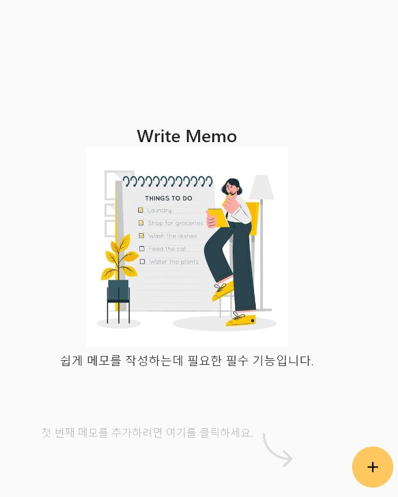
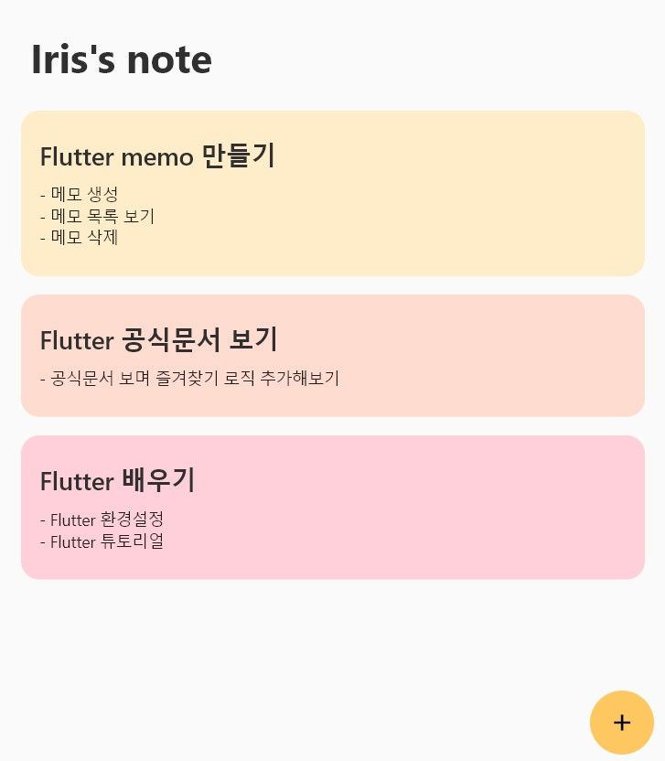
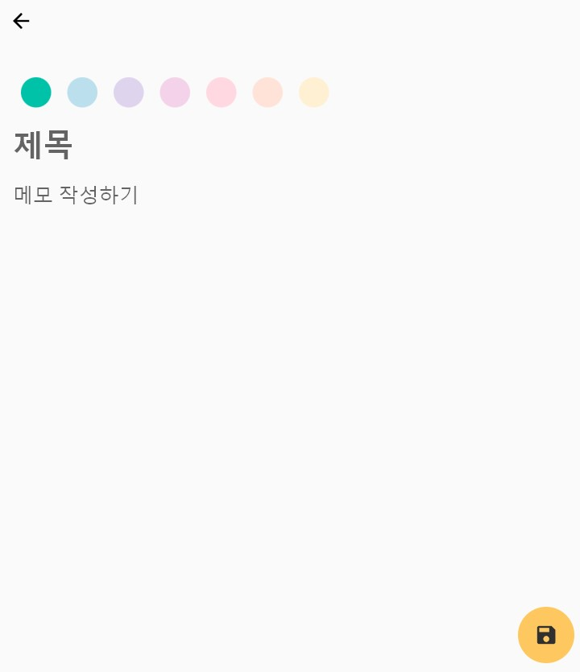
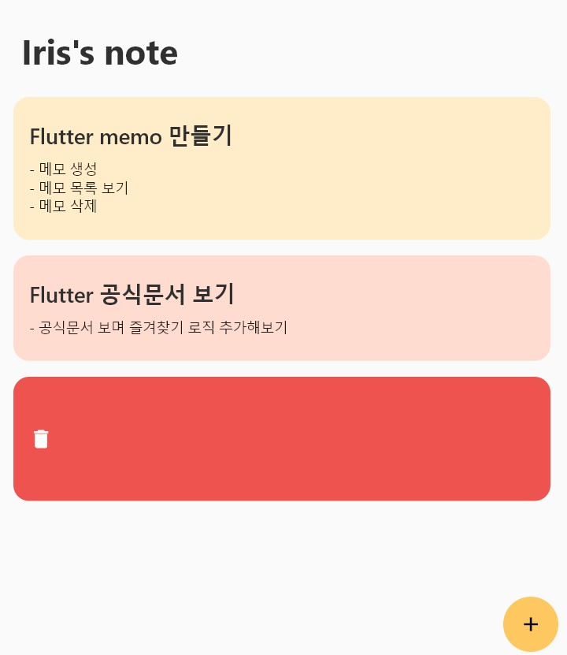
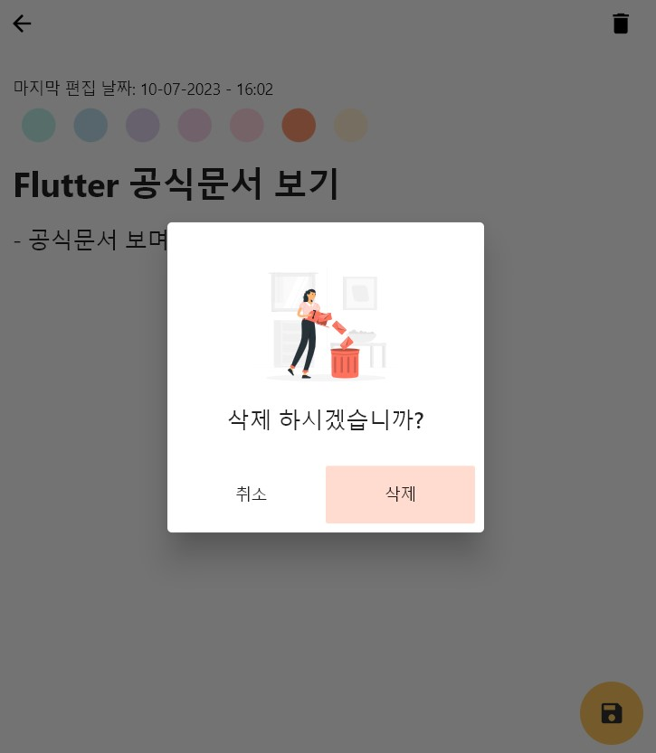

# **Flutter memo app**
> 출처: https://github.com/VALERIO-CALCAGNI/lerionote/tree/master 


### Summary
1. [flutter memo app](#1---flutter memo app)
2. [사용 방법](#2---사용-방법)
3. [프로젝트 구조](#3---프로젝트-구조)


## 1 - flutter memo app


<p align="center">
  
  
</p>


## 2 - 사용 방법
1. *+* 버튼을 클릭해 새로운 메모를 생성합니다.
2. 원하는 색을 선택합니다.
3. 제목과 내용을 입력합니다.
4. 저장 버튼을 클릭합니다.

### **메모 생성**
<p align="center">
    
</p>
- 오른쪽으로 swipe 하면 메모 삭제가 가능합니다.

### **메모 삭제 기능**
<p align="center">
  
  
  
</p>


## 3 - 프로젝트 구조
```
.
├── ...
├── assets                      
│   ├── icons          
│   └── images
│
├── build             
├── lib              
│   ├── db                      
│   │   └── notes_database.dart
│   │
│   ├── models                  
│   │   └── note.dart
│   │
│   ├── screens 
│   │   ├── homepage  
│   │   │   ├── homepage.dart
│   │   │   └── components
│   │   │       └── ....
│   │   │
│   │   ├── edit_add_note_screen       
│   │   │   ├── edit_add_note_screen.dart
│   │   │   └── components
│   │   │       └── ....  
│   │   │ 
│   │   └── splash_screen
│   │       └── splash_screen.dart
│   │   
│   ├── constants.dart  
│   ├── routes.dart  
│   └── main.dart                    
│   
├── test  
├── ...
├── ...
├── pubspech.lock
└── pubspech.yaml     

```


